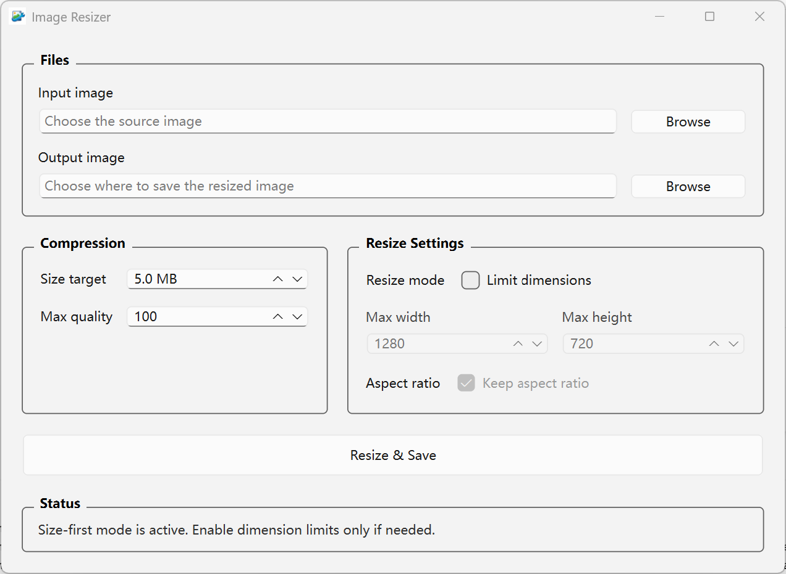

# Image Resizer

A simple desktop tool to prepare images for upload by prioritizing file size first, with optional dimension limits when needed.

---

## 📸 App Preview



---

## ✨ Why this tool

Many websites require images to meet strict file size or dimension limits.

However:
- Photos from phones are often too large
- Online tools are inconvenient or unreliable
- Existing software is overly complex

This tool provides a **simple and fast way** to prepare images for upload.

---

## 🚀 Features

- Size-first workflow by default
- Target specific file sizes (e.g., under 5MB)
- Automatically maximize quality while staying under the target size
- Optional width and height limits when file-size compression alone is not enough
- Maintain aspect ratio when dimension limits are enabled
- Simple desktop interface

---

## 🖼️ Use Cases

- Uploading documents to government websites
- Insurance claim submissions
- Job application portals
- Social media uploads

---

## 📦 Installation

```bash
pip install -r requirements.txt
```

---

## ▶️ Run

```bash
python src/main.py
```

---

## 🧩 Supported Formats

- Input: PNG, JPG, JPEG, WEBP, BMP, TIFF
- Output: JPG, JPEG, PNG, WEBP
- Target file size mode is available for JPEG and WEBP output
- PNG output is supported, but it does not use quality-based target-size compression

---

## ⚙️ Default Behavior

- The app starts in size-first mode
- Target file size is enabled by default and starts at `5.0 MB`
- Dimension limits are optional and disabled by default
- If the target cannot be reached by quality alone, you can enable dimension limits as a fallback
